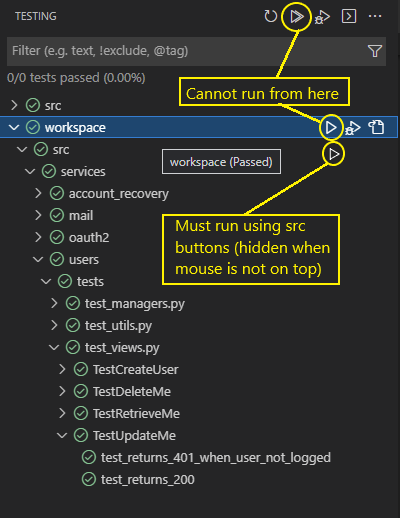

When using this template:
- Pin requirements version

TODO:
- drf-spectacular documentation
- sphinx documentation
- type documentation
- README
- notification module with user client info
- separate test in unit and integration
- remove rqworker and scheduler from containers and prefer to run locally
- Configure logger
- Third party admin

# Notes

## Pytest
Unused arguments:
- `--cov` for coverage
- `-n 4` to run the tests in 4 threads
- `-p no:warnings` to hide warnings

This options can go in:
- In the command line when invoked to run sporadically
- In vscode **settings** or **devcontainer.json** in `python.testing.pytestArgs` to run in VSCode builtin test runner
- In pytest.ini to run always

Problems running from root directory in VSCode test runner window:



With the following configuration pytest must be run from src in VSCode test window
```json
"python.testing.pytestArgs": ["src/", "-vv"],
```

With the following configuration tests can be run clicking the arrow on top but individual tests cannot be run from 
```json
"python.testing.pytestArgs": [
    "--rootdir",
    "${workspaceFolder}/src",
    "-vv"
],
```
